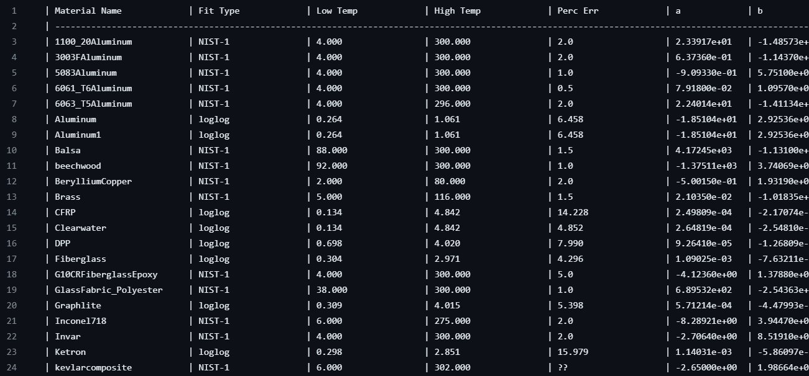

Compilation File
==============

The compilation file is of the following structure::

    | Material Name                   | Fit Type                   | Low Temp                   | High Temp                   | Perc Err                   | erf param                   | a                | b                | c               | ...
    | ------------------------------------------------------------------------------------------------------------------------------------------------------------------------------------------------------------------------------------------------
    | Stainless_Steel_304             | comppoly                   | 0.385                      | 1672.000                    | 3.953                      | 1.19786e+02                 | 6.96e-02         | 3.01e-03         | -5.04e-05       | ...

Fit Type : Defines the structure of the fit. See the *fit_types.py* file for python functions corresponding to each Fit Type.

Low Temp/High Temp : Define the range (low, high) of the fit function in Kelvin (K)

Perc Err: Defines the average percent error of the fit, as reported by the fit source, or the fitting algorithm.

lower case letters : Define the fit parameters for the low temperature fit ``(a+bT+cT^2+...)``

upper case letters : Define the fit parameters for the high temperature fit ``(A+B*Log10(T)+C*(Log10(T))^2+D*(Log10(T))^3+...)``

erf param : Defines the temperature point (in K) at which the error function is positioned for the compound fits. Reports 0.0 if not a compound fit.

The compiled file is conveniently output in both .txt format, as well as .csv. The .txt is designed to be human readable... see below:
