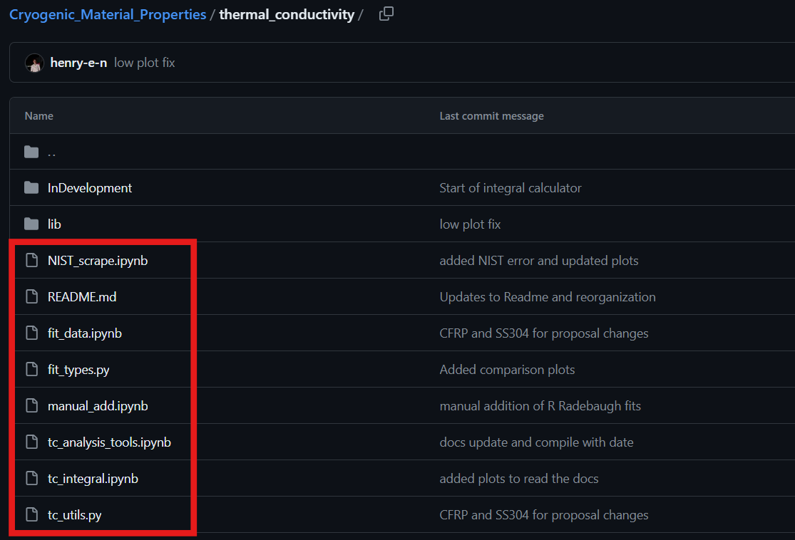

Repository Structure
====================

Upon navigating to the repository you will be met with the following view:

The primary output of this repository are files containing a compilation of the available material property fits. These can be found in .txt and .csv files as shown in the following image. The red box indicates a compiled file of all materials fits from all sources. The blue box shows the fits that were taken directly from the NIST cryogenic materials repository website.

.. image:: images/RepoHome_compboxes.png

This folder contains example thermal models showing how this repository can be used in a scientific application.

All of the backend code and material library is contained in the following folder.

.. image:: images/RepoHome_tcbox.png

Stepping into the *thermal_conductivity* folder, you should see a view such as this.

Here you will find all of the python and Jupyter notebooks used in the creation of the structure and fits of the repository.

The actual library of material data is housed in the following folder.

.. image:: images/tc_libbox.png

This is the view of the library of materials.

.. image:: images/lib_home.png

Here is an example material folder. At the root level, this folder contains both plots of the material data with corresponding fits as well as a config.yaml file. Within the subfolders you will find the files describing the produced fit, and other fits created either by NIST (if applicable) or other sources. If the material has raw data it will be stored within the *RAW* directory where each dataset is saved as a .csv file. You will also find the data references within this folder. 

All current development exists within the 'thermal_conductivity' folder

* thermal_conductivity_conductivity.csv
* thermal_conductivity_conductivity.txt
* compile_TC.py

  * thermal_conductivity

    * fit_data.ipynb
    * fit_types.py
    * manual_add.ipynb
    * NIST_scrape.ipynb
    * lib
      * <Material Name>
        * fits
        * NIST
        * plots
        * RAW